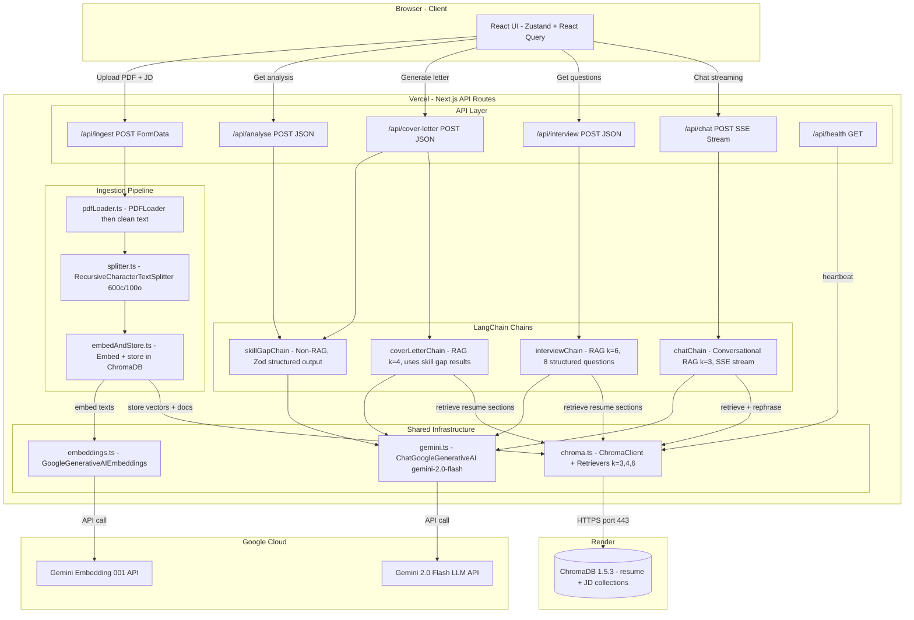
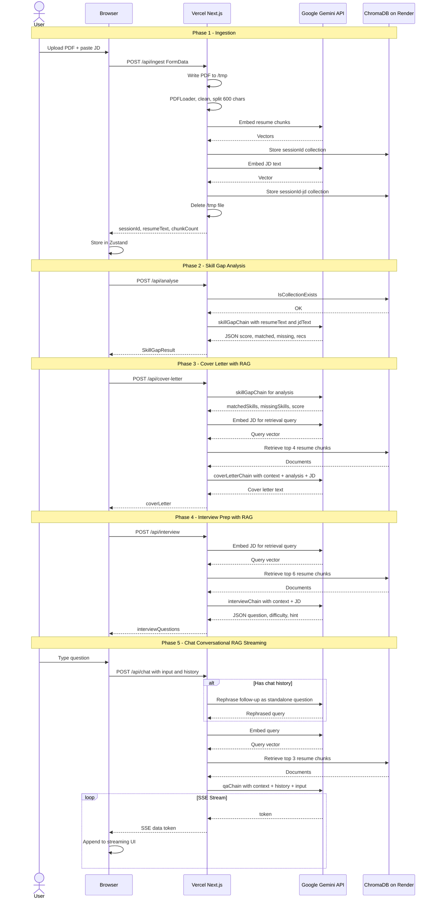

```mermaid
flowchart TB
    subgraph CLIENT["Browser - Client"]
        UI["React UI - Zustand + React Query"]
    end

    subgraph VERCEL["Vercel - Next.js API Routes"]
        subgraph API["API Layer"]
            INGEST["/api/ingest POST FormData"]
            ANALYSE["/api/analyse POST JSON"]
            COVER["/api/cover-letter POST JSON"]
            INTERVIEW["/api/interview POST JSON"]
            CHAT["/api/chat POST SSE Stream"]
            HEALTH["/api/health GET"]
        end

        subgraph INGEST_PIPELINE["Ingestion Pipeline"]
            PDF_LOADER["pdfLoader.ts - PDFLoader then clean text"]
            SPLITTER["splitter.ts - RecursiveCharacterTextSplitter 600c/100o"]
            EMBED_STORE["embedAndStore.ts - Embed + store in ChromaDB"]
        end

        subgraph CHAINS["LangChain Chains"]
            SKILL_GAP["skillGapChain - Non-RAG, Zod structured output"]
            COVER_CHAIN["coverLetterChain - RAG k=4, uses skill gap results"]
            INTERVIEW_CHAIN["interviewChain - RAG k=6, 8 structured questions"]
            CHAT_CHAIN["chatChain - Conversational RAG k=3, SSE stream"]
        end

        subgraph INFRA["Shared Infrastructure"]
            GEMINI["gemini.ts - ChatGoogleGenerativeAI gemini-2.0-flash"]
            EMBEDDINGS["embeddings.ts - GoogleGenerativeAIEmbeddings"]
            CHROMA_LIB["chroma.ts - ChromaClient + Retrievers k=3,4,6"]
        end
    end

    subgraph RENDER["Render"]
        CHROMADB[("ChromaDB 1.5.3 - resume + JD collections")]
    end

    subgraph GOOGLE["Google Cloud"]
        GEMINI_API["Gemini 2.0 Flash LLM API"]
        EMBED_API["Gemini Embedding 001 API"]
    end

    UI -- "Upload PDF + JD" --> INGEST
    UI -- "Get analysis" --> ANALYSE
    UI -- "Generate letter" --> COVER
    UI -- "Get questions" --> INTERVIEW
    UI -- "Chat streaming" --> CHAT

    INGEST --> PDF_LOADER --> SPLITTER --> EMBED_STORE
    EMBED_STORE -- "embed texts" --> EMBEDDINGS
    EMBED_STORE -- "store vectors + docs" --> CHROMA_LIB

    ANALYSE --> SKILL_GAP
    COVER --> SKILL_GAP
    COVER --> COVER_CHAIN
    INTERVIEW --> INTERVIEW_CHAIN
    CHAT --> CHAT_CHAIN

    SKILL_GAP --> GEMINI
    COVER_CHAIN --> GEMINI
    COVER_CHAIN -- "retrieve resume sections" --> CHROMA_LIB
    INTERVIEW_CHAIN --> GEMINI
    INTERVIEW_CHAIN -- "retrieve resume sections" --> CHROMA_LIB
    CHAT_CHAIN --> GEMINI
    CHAT_CHAIN -- "retrieve + rephrase" --> CHROMA_LIB

    CHROMA_LIB -- "HTTPS port 443" --> CHROMADB
    GEMINI -- "API call" --> GEMINI_API
    EMBEDDINGS -- "API call" --> EMBED_API
    HEALTH -- "heartbeat" --> CHROMA_LIB
```

---

```mermaid
sequenceDiagram
    actor User
    participant Browser
    participant Vercel as Vercel Next.js
    participant Gemini as Google Gemini API
    participant Chroma as ChromaDB on Render

    Note over User,Chroma: Phase 1 - Ingestion

    User->>Browser: Upload PDF + paste JD
    Browser->>Vercel: POST /api/ingest FormData
    Vercel->>Vercel: Write PDF to /tmp
    Vercel->>Vercel: PDFLoader, clean, split 600 chars
    Vercel->>Gemini: Embed resume chunks
    Gemini-->>Vercel: Vectors
    Vercel->>Chroma: Store sessionId collection
    Vercel->>Gemini: Embed JD text
    Gemini-->>Vercel: Vector
    Vercel->>Chroma: Store sessionId-jd collection
    Vercel->>Vercel: Delete /tmp file
    Vercel-->>Browser: sessionId, resumeText, chunkCount
    Browser->>Browser: Store in Zustand

    Note over User,Chroma: Phase 2 - Skill Gap Analysis

    Browser->>Vercel: POST /api/analyse
    Vercel->>Chroma: IsCollectionExists
    Chroma-->>Vercel: OK
    Vercel->>Gemini: skillGapChain with resumeText and jdText
    Gemini-->>Vercel: JSON score, matched, missing, recs
    Vercel-->>Browser: SkillGapResult

    Note over User,Chroma: Phase 3 - Cover Letter with RAG

    Browser->>Vercel: POST /api/cover-letter
    Vercel->>Gemini: skillGapChain for analysis
    Gemini-->>Vercel: matchedSkills, missingSkills, score
    Vercel->>Gemini: Embed JD for retrieval query
    Gemini-->>Vercel: Query vector
    Vercel->>Chroma: Retrieve top 4 resume chunks
    Chroma-->>Vercel: Documents
    Vercel->>Gemini: coverLetterChain with context + analysis + JD
    Gemini-->>Vercel: Cover letter text
    Vercel-->>Browser: coverLetter

    Note over User,Chroma: Phase 4 - Interview Prep with RAG

    Browser->>Vercel: POST /api/interview
    Vercel->>Gemini: Embed JD for retrieval query
    Gemini-->>Vercel: Query vector
    Vercel->>Chroma: Retrieve top 6 resume chunks
    Chroma-->>Vercel: Documents
    Vercel->>Gemini: interviewChain with context + JD
    Gemini-->>Vercel: JSON question, difficulty, hint
    Vercel-->>Browser: interviewQuestions

    Note over User,Chroma: Phase 5 - Chat Conversational RAG Streaming

    User->>Browser: Type question
    Browser->>Vercel: POST /api/chat with input and history
    alt Has chat history
        Vercel->>Gemini: Rephrase follow-up as standalone question
        Gemini-->>Vercel: Rephrased query
    end
    Vercel->>Gemini: Embed query
    Gemini-->>Vercel: Query vector
    Vercel->>Chroma: Retrieve top 3 resume chunks
    Chroma-->>Vercel: Documents
    Vercel->>Gemini: qaChain with context + history + input
    loop SSE Stream
        Gemini-->>Vercel: token
        Vercel-->>Browser: SSE data token
        Browser->>Browser: Append to streaming UI
    end
```
